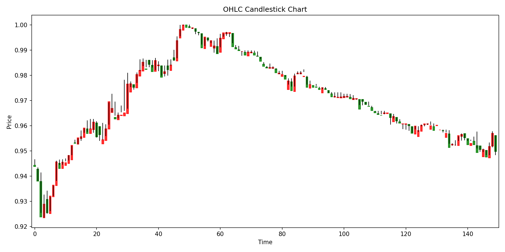
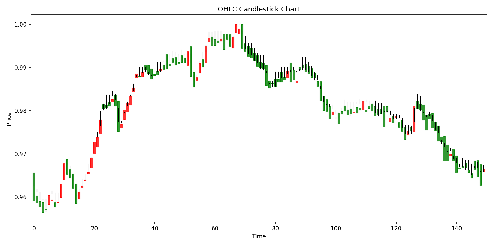
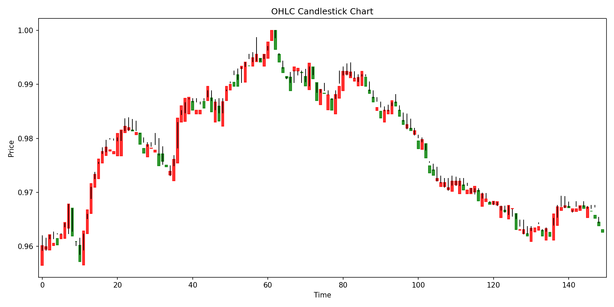
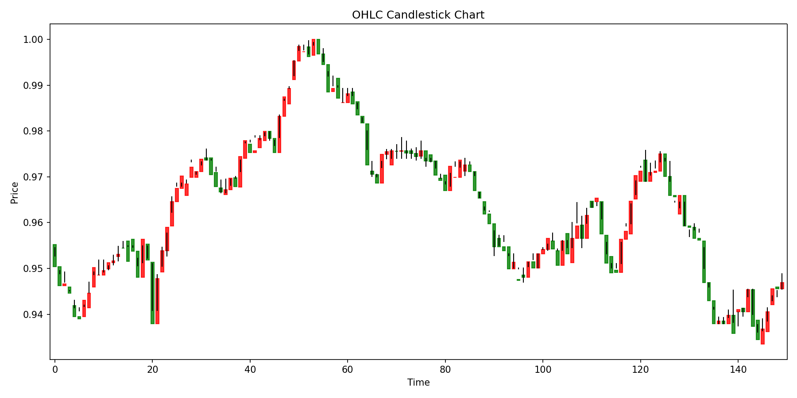
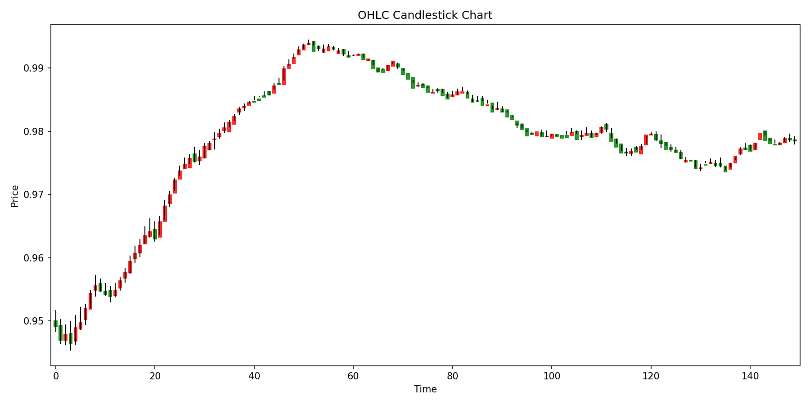

# APF - Alperen Pattern Finder

[](https://opensource.org/licenses/MIT)
[](https://www.python.org/downloads/release/python-380/)
[](https://numpy.org/)
[](https://pandas.pydata.org/)
[](https://matplotlib.org/)

## Table of Contents
- [Introduction](#introduction)
- [Features](#features)
- [Installation](#installation)
- [Usage](#usage)
- [Algorithm Overview](#algorithm-overview)
- [Contributing](#contributing)
- [License](#license)

## Introduction
APF (Alperen Pattern Finder) is an algorithm designed to efficiently identify patterns within datasets. (Intiutively it is more than a pattern searcher than a pattern finder, but I'm too lazy to change the repo name :)) It can be applied on bioinformatics, financial data analysis, sensor data processing, and more. This repository contains the full implementation, documentation, and usage examples. You can see the example plots from below.

### Example Plots

* This example is generated using the bitcoin historical data, with 1 minute ticker from 2017 to 2018. The algorithm used cosine similarity and max normalization as preprocessing function. The query sequence length is 120, future length is 30, top k is 17 and stride is 30. Our algorithm compared each sequence in the search space with the query sequence and found the top 17 closest sequences. Then, it predicted the future sequence using a weighted average of the future sequences of the top 17 closest sequences.

#### Query Sequence


#### Top 3 Closest Sequences
 
 


#### Weighted Prediction of Top 17 Closest Sequences


## Features
- Fast pattern detection
- Configurable parameters
- Easy integration
- Well-documented codebase

## Installation
Clone the repository:
```bash
git clone https://github.com/alperendemirci/APF.git
```
Install dependencies:
```bash
cd APF
pip install -r requirements.txt
```

## Usage

* You can select different preprocessing functions such as 'min_max', 'z_score', 'max_norm', or 'backward_roc' (default is 'min_max').

* You can choose different similarity functions such as 'euclidean', 'cosine', 'manhattan', or 'dot_product' (default is 'cosine').

* You can specify whether to plot OHLC (Open, High, Low, Close) charts or single dimension series plots using the `--plot_ohlc` flag. If this flag is set, OHLC charts will be generated; otherwise, single dimension series plots will be created. This option is useful for financial data representation.

* You can choose between two search methods: Brute Force Search and FFT Based Search. The Brute Force Search method compares the query sequence against all possible sequences in the dataset, while the FFT Based Search method utilizes Fast Fourier Transform to perform the search in the frequency domain, which can be more efficient for large datasets.

### Brute Force Search
* If you query using a query CSV file, the script will read the sequences from the CSV file and perform the search for each sequence in the file. Example command is shown below:
```bash
python simple_search.py --data_path btc.csv --future_length 20 --top_k 17 --stride 20 --similarity_function 'cosine' --output_dir plots_arg --query_csv plots/query.csv  --preprocessing_function 'max_norm'

```
* If you query using integer indexing, the script will read the query sequence from the search space with strating from given query index with a length of sequence length parameter. Example command is shown below:
```bash
python simple_search.py --data_path btc.csv --sequence_length 124 --future_length 20 --top_k 17 --stride 20 --similarity_function 'cosine' --output_dir plots_arg --query_index 4110 --preprocessing_function 'max_norm'
```

### FFT Based Search
* Only difference between brute force search and FFT based search lies in the searching domain. FFT Search searches in the frequency domain. You do not need to provide any similarity function since the similarity is calculated using the dot product in the frequency domain. Example command is shown below:

```bash
python fft_search.py --data_path btc.csv --sequence_length 124 --future_length 20 --top_k 17 --stride 20  --output_dir plots_arg --query_csv plots/query.csv  --preprocessing_function 'max_norm' 
```


For more options, see:
```bash
python simple_search.py -h
```

## Algorithm Overview
The Alperen Pattern Finder algorithm uses brute force search to locate recurring patterns in large datasets. It simply searches the entire search space using the hyperparamters(i.e. stride) and retrieves the top matches using a specified similarity function & data preprocessing function. 

## Contributing
Contributions are welcome! Please open issues or submit pull requests for improvements or bug fixes.

## License
This project is licensed under the MIT License.
